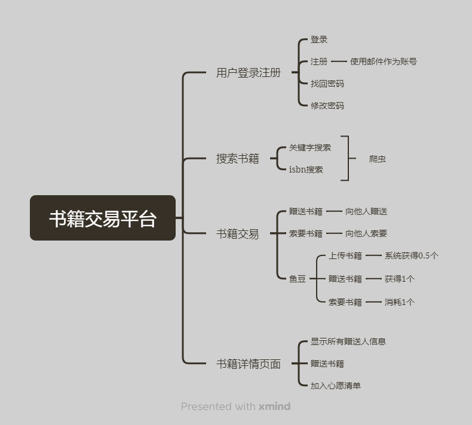
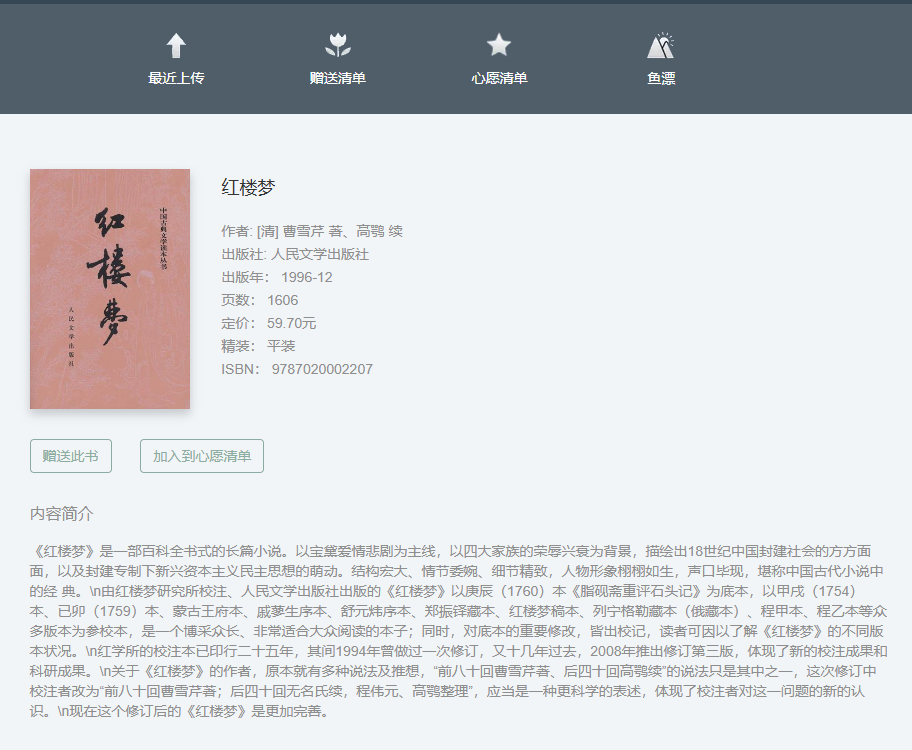

# 书籍赠送平台

### 项目描述

这是一个免费的二手书籍赠送和获取平台，主要面向的毕业生的二手书籍的处理问题，帮助学弟学妹们节约买书费用。

### 功能

✅ 账号的注册，登录，修改，找回

✅ 书籍搜索，关键字和isbn搜索

✅ 书籍交易，赠送书籍和所有书籍

 ### 环境

>conda create --name book_app  # 创建虚拟环境
>
>conda activate book_app  # 激活虚拟环境
>
>pip install -r requirements.txt  # 安装依赖
>
>python fisher.py  # 运行

### 页面展示

